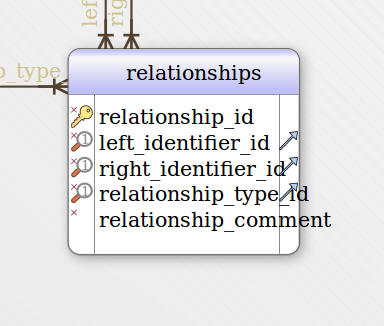
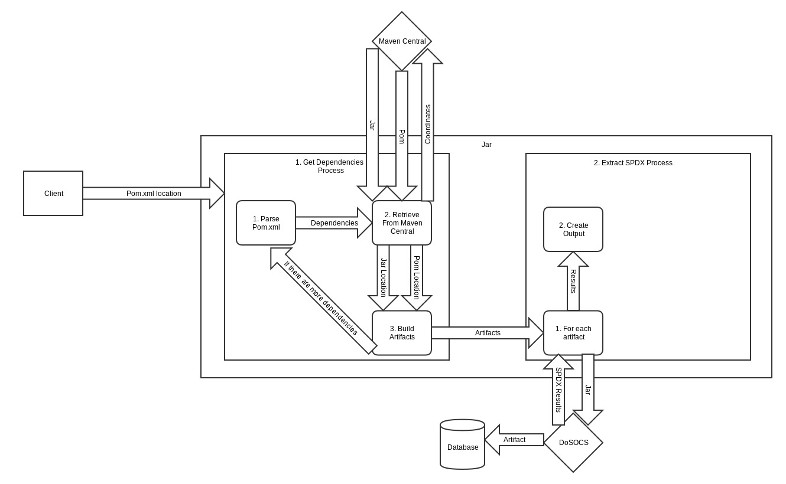

# System Description

Our project will be used to develop spdx documents that have relationships built on a given pom.xml file. This project is used to analyze a project pom and generate spdx reports on that project as well as populating a DoSOCS database with the corresponding relationship. 

# Development Environment

OS: Ubuntu 14.04

Programming Language: Java

Used for Development: Maven, DoSOCS, SQLite3, and Python

# Communication Management Plan

We will use Github Issues to communicate what is done and what needs to be done. We will use email as needed for communication outside of Github.

# License and Copyright

All associated documentation is licensed under the terms of the Creative Commons Attribution Share-Alike 3.0 license. See the file CC-BY-SA-3.0 for more details.

Software licensed under Apache 2.0, see the file LICENSE for details.

Copyright:

Joseph Eley

Cooper Pendleton

# Database Schema of the System

We will use is the SPDX spec that DoSOCS uses. Relationships are stored in the existing RELATIONSHIPS table.

# Dataflow Diagram

# How to Use

Need to have installed:

Java, Maven, DoSOCS, Python

Two Options:

1. Download/clone source
2. Run "mvn clean install" from the root of the project
3. run the jar that is created in the target/ directory with the location of the pom.xml and the jar file that you want to analyze as an argument. So for example "java -jar internetSystemsDev-3-jar-with-dependencies.jar pom.xml project-for-pom.jar"
4. The jar can also be used to pull the first level of dependencies of a project from the database. To do this, simply pass the jar as an argument. Ex. "java -jar project.jar"

or 

1. Download source
2. Run pre-built jar in the releases folder with the location of your pom and jar file. So for example "java -jar internetSystemsDev-3-jar-with-dependencies.jar /location/of/pom.xml project-for-pom.jar"
3. The jar can also be used to pull the first level of dependencies of a project from the database. To do this, simply pass the jar as an argument. Ex. "java -jar project.jar"

Usage:

Command: java -jar /location/of/pom.xml \[jarname\].jar \[options\]

Command: java -jar \[jarname\].jar

Options: 

-p - print dependency tree

-h - print usage

# How to Run Tests

1. Download/clone source
2. Run "mvn clean install" from the root of the project. This also runs the tests. 
